# **GitHub Actions con Sonarcloud**
Pipeline en GitHub Actions con Sonarcloud en la arquitectura monolítica utilizando un proyecto Maven

## **Requisitos Previos**

- __[Tener una cuenta GitHub](https://github.com/)__
- **Tener un repositorio con un proyecto maven en GitHub**

## **Pasos GitHub Actions con Sonarcloud**

- Repositorio con un proyecto maven en GitHub que utilizaremos

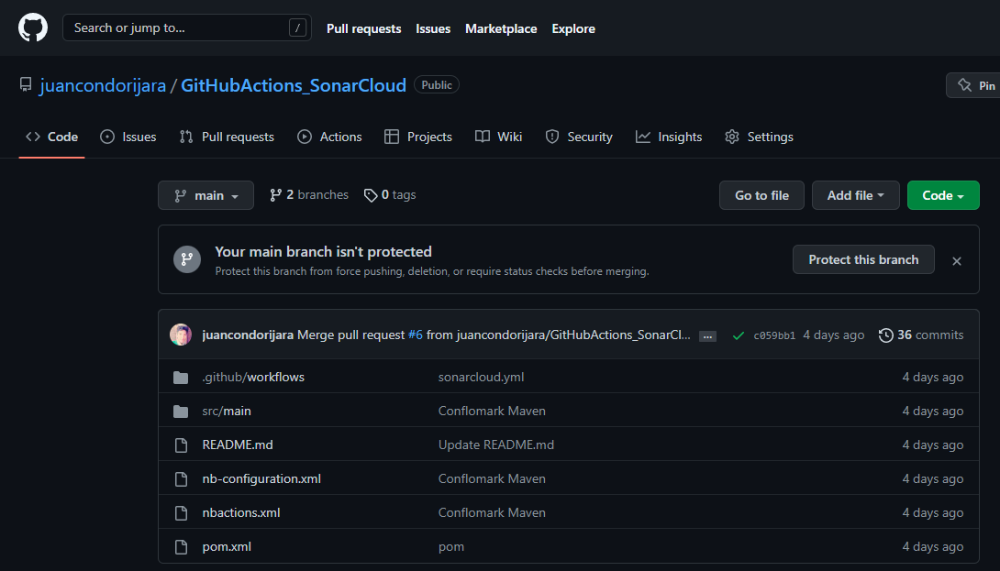

- Iniciar sesión en [Sonarcloud](https://sonarcloud.io/login?utm_medium=social&utm_source=youtube&utm_campaign=code-quality&utm_content=onboardingvideo) con GitHub para importar nuestra cuenta como una organización

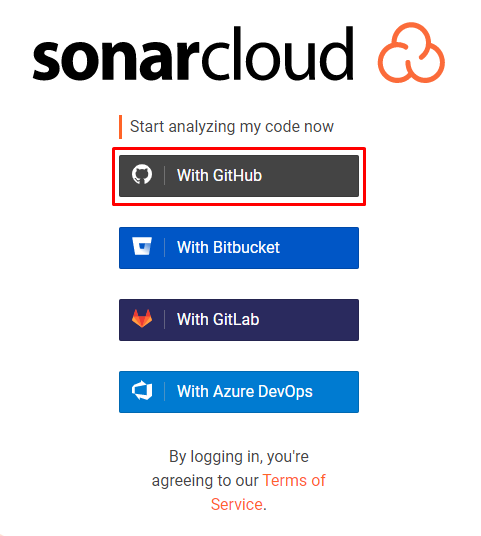
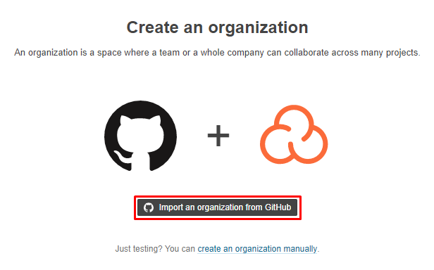
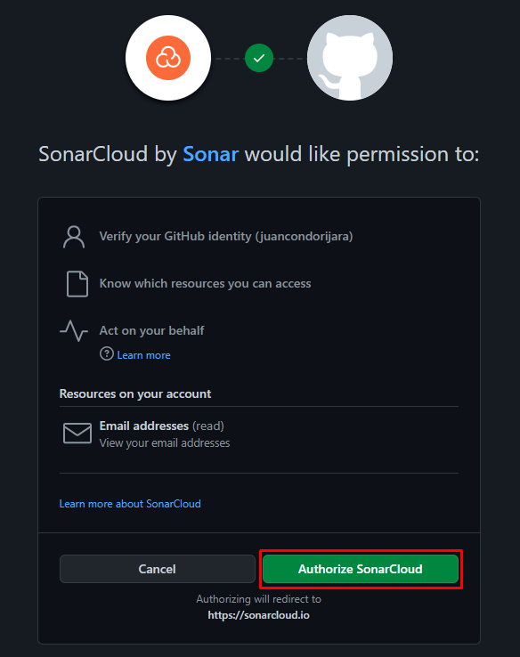
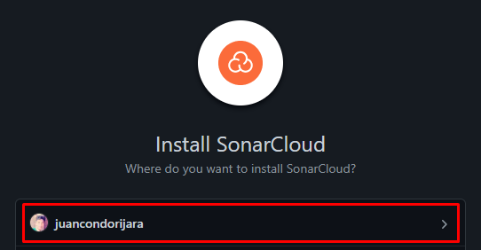
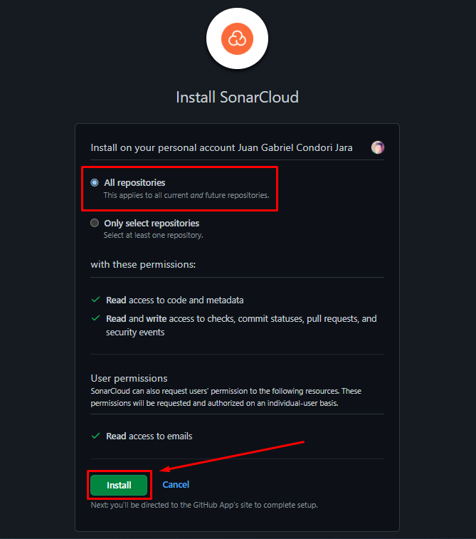

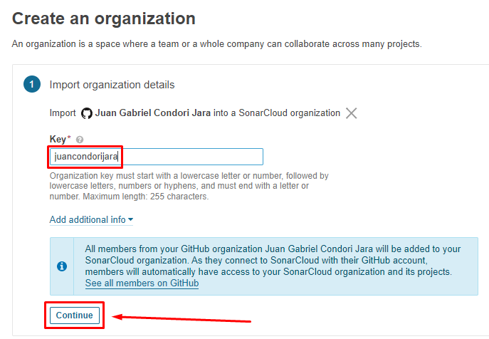

- Analizar un proyecto en Sonarcloud con la organización creada

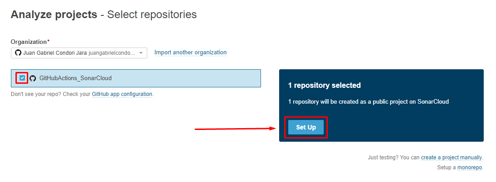
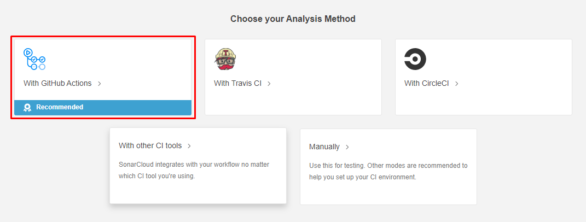
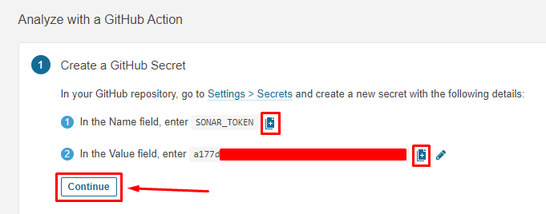
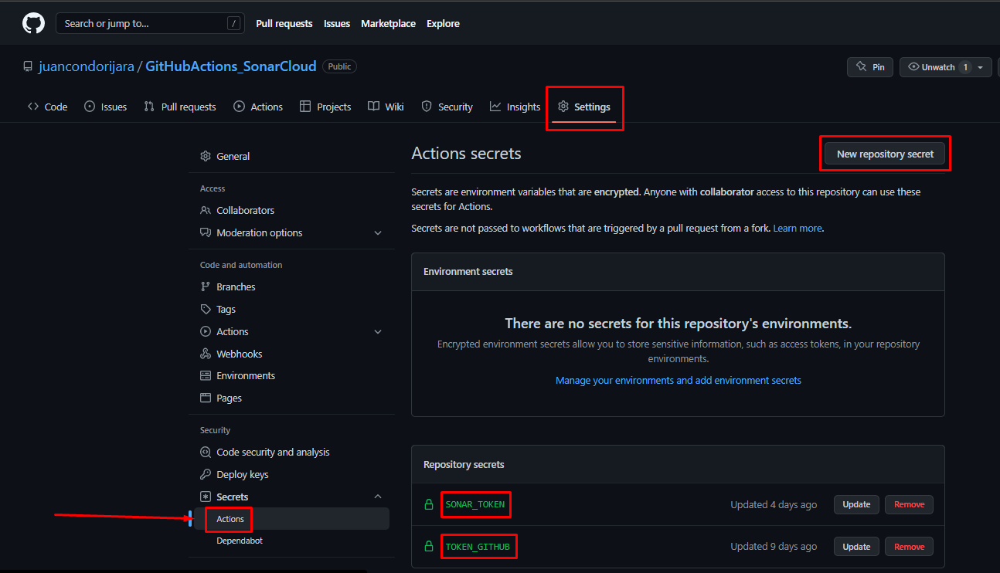

- Analizar un proyecto en Sonarcloud con la organización creada

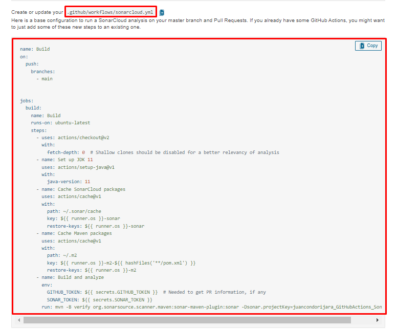
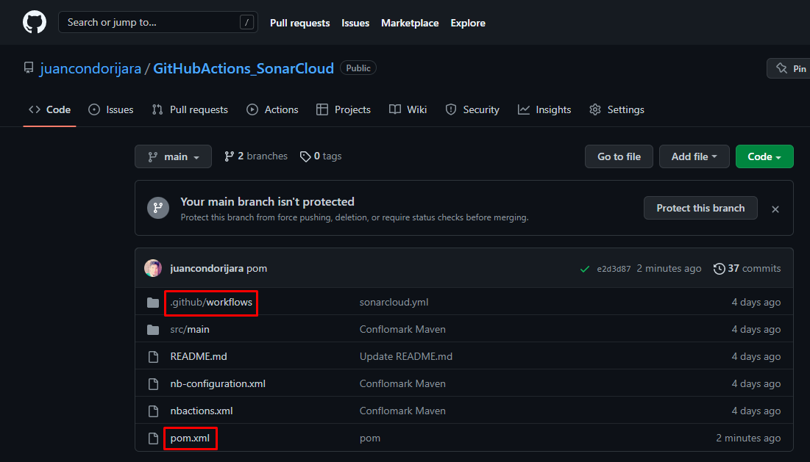

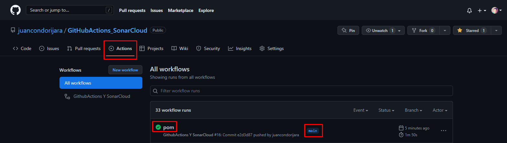
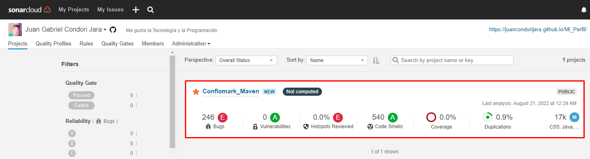
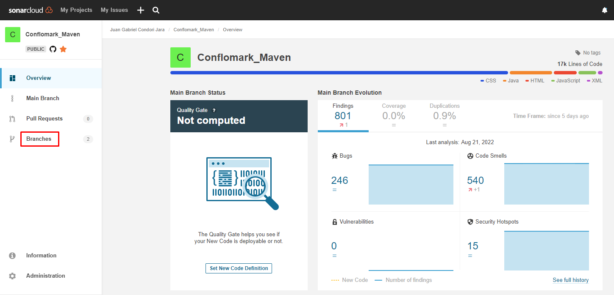
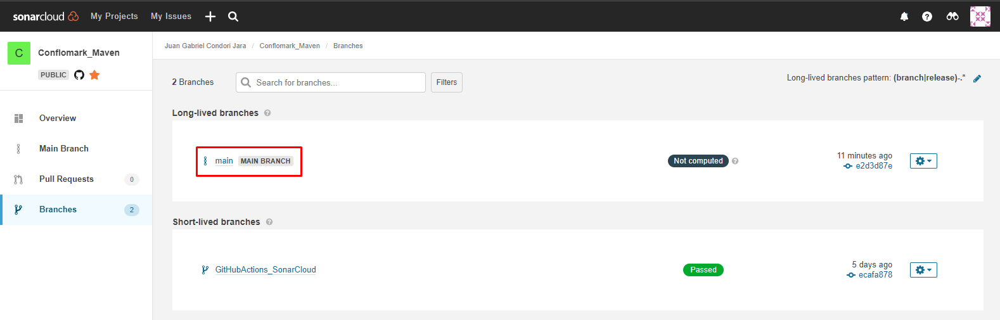
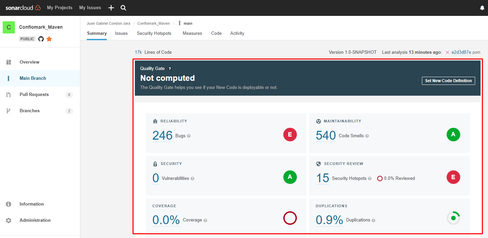
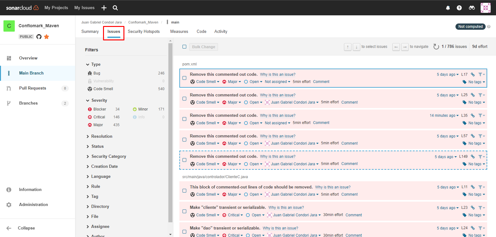

## **Bibliografía**

- __[Youtube - Analizando la calidad de tus proyectos con GitHub Actions y Sonar](https://www.youtube.com/watch?v=4sdX_mGko_M)__

- __[Guía - Analice su repositorio con GitHub Actions](https://docs.sonarcloud.io/advanced-setup/ci-based-analysis/github-actions/)__

- __[Guía - GitHub Actions y SonarCloud](https://technology.amis.nl/software-development/github-actions-and-sonarcloud/)__
